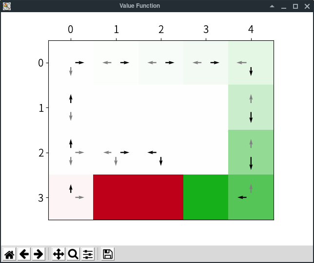

RLPy3
========

|Azure| |pypi-version|

.. |Azure| image:: https://dev.azure.com/kngwyu/RLPy/_apis/build/status/kngwyu.rlpy3?branchName=master
   :alt: Azure Pipelines
   :target: https://dev.azure.com/kngwyu/RLPy/_build/latest?definitionId=3&branchName=master

.. |pypi-python-version| image:: https://img.shields.io/pypi/pyversions/rlpy3
   :alt: PyPI
   :target: https://pypi.org/project/rlpy3/2.0.0b

Why Fork?
----------
This is my fork of RLPy.

`RLPy`_ is a great reinforcement learning library with some good features
like custom representations and value function viewers.
However, it is no longer maintained and the PyPI version of RLPy is not
compatible with the latest numpy C-API, which causes runtime errors.

So I decided to fork the repository and provide a maintained version of
RLPy only for Python>=3.5, named RLPy3.
You can download wheels of RLPy3 from `PyPI`_.

.. _RLPy: https://github.com/rlpy/rlpy
.. _PyPI: https://pypi.org/project/rlpy3

In addition, I pushed lots of refactorings, bug fixes, new environments
such as `FixedRewardGridWorld`_, and new algorithms such as `PSRL`_.
Refactorings include removing some modules (like one for parallel experiments).
This does **not** means *these modules are bad*, but I need to keep the entire
modules simple for maintaining them alone.

To see what was changed, see the new `CHANGELOG`_.

.. _CHANGELOG: ./CHANGELOG.md
.. _FixedRewardGridWorld: ./rlpy/domains/fixed_reward_grid_world.py
.. _PSRL: ./rlpy/agents/psrl.py

Install
--------
The latest version is 2.0.0 beta, which you can install by::

  pip3 install rlpy3 -U --pre

Screenshots
------------
.. figure:: pictures/GridWorld4x5Domain.png

   An agent that explores `GridWorld`_.

   Value function of the agent.

.. _GridWorld: ./rlpy/domains/GridWorld.py

Original README: RLPy - Reinforment Learning Framework
=======================================================

RLPy is a framework to conduct sequential decision making experiments. The
current focus of this project lies on value-function-based reinforcement
learning. The project is distributed under the 3-Clause BSD License.

Important Links
----------------

- Official source code repository: http://github.com/rlpy/rlpy
- Bitbucket mirror: http://bitbucket.org/rlpy/rlpy
- Documentation: http://rlpy.readthedocs.org
- Issue tracker: https://github.com/rlpy/rlpy/issues

Install
--------

Installation instructions can be found at http://rlpy.readthedocs.org/en/latest/install.html
